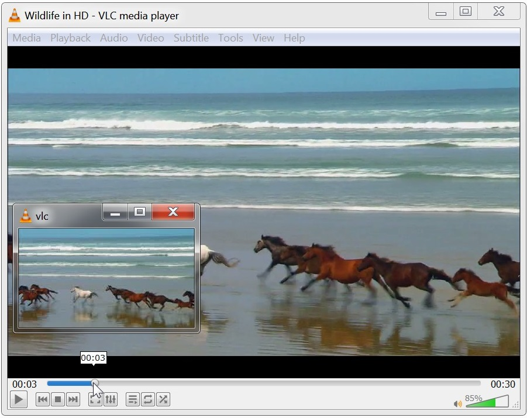

# vlc_frame_preview_feature  

## Usage  

Use [g_files/create_frames.bat](g_files) to create frames. 
Frames will be created at `frames` folder at the video file path.

e.g.  
```
// Create frames for wildlife.mp4
create_frames.bat wildlife  
```

  


## Build 
Source: https://medium.com/@tobias.strg/compiling-vlc-3-x-in-2020-a390c6a73c24     
 
2. Start the docker instance, by running this command:    

```
$ cd ~
$ mkdir win64 && cd win64
$ git clone git://git.videolan.org/vlc/vlc-3.0.git
$ docker run -v ~/win64:/win64 -i -t registry.videolan.org:5000/vlc-debian-win64 /bin/bash
```

3. At this point docker will download the image if it is not in your cache and you will be interacting with the instance once it returns. You should see something like  

```  
root@cf204d746bf1:/#  
```  

cd /win64/vlc-3.0/   
and build:     
```
./extras/package/win32/build.sh -l -a x86_64 -i n
```

7. Once the process finishes, the Windows binary can be found in the folder /win64/vlc-3.0/win64/ on the docker instance, and likewise ~/win64/vlc-3.0/win64/ on the host instance  

8. On host:  
```
sudo zip -r -l -q -f vlc.zip vlc-3.0.15  
```   

-------------------------  

Other steps which I did not have to do:     

```  
4. Before we start building, we need to install a few dependencies that are left out (in spite of using a pre-made build instance):  
# apt-get update && apt-get install -y python  
  
5. There are also some errors with WINE on the docker images, details can be found here (thanks to mmu_man for this excellent bug report). The commands that follow are directly taken from there:  

# apt-get remove wine64
# dpkg --add-architecture i386 && apt-get update && apt-get install wine32 winetricks
# wget https://dl.winehq.org/wine/wine-mono/4.8.0/wine-mono-4.8.0.msi
# wine msiexec /i wine-mono-4.8.0.msi
# wget https://github.com/wixtoolset/wix3/releases/download/wix3111rtm/wix311-binaries.zip
# mkdir -p ~/'.wine/dosdevices/c:/Program Files (x86)/Windows Installer XML v3.5/bin'
# unzip -d ~/'.wine/dosdevices/c:/Program Files (x86)/Windows Installer XML v3.5/bin' wix311-binaries.zip
```
   
<br /><br /><br />  
    
//////////////////////////////// Orig README   
  
<br /><br /><br />
   
```

README for the VLC media player  
===============================  

VLC is a popular libre and open source media player and multimedia engine,  
used by a large number of individuals, professionals, companies and  
institutions. Using open source technologies and libraries, VLC has been  
ported to most computing platforms, including GNU/Linux, Windows, Mac OS X,  
BSD, iOS and Android.  
VLC can play most multimedia files, discs, streams, allows playback from  
devices, and is able to convert to or stream in various formats.  
The VideoLAN project was started at the university École Centrale Paris who  
relicensed VLC under the GPLv2 license in February 2001. Since then, VLC has  
been downloaded close to one billion times.  

Links:
======

The VLC web site  . . . . . http://www.videolan.org/
Support . . . . . . . . . . http://www.videolan.org/support/
Forums  . . . . . . . . . . http://forum.videolan.org/
Wiki  . . . . . . . . . . . http://wiki.videolan.org/
The Developers site . . . . http://wiki.videolan.org/Developers_Corner
VLC hacking guide . . . . . http://wiki.videolan.org/Hacker_Guide
Bugtracker  . . . . . . . . http://trac.videolan.org/vlc/
The VideoLAN web site . . . http://www.videolan.org/

Source Code Content:
===================
ABOUT-NLS          - Notes on the Free Translation Project.
AUTHORS            - VLC authors.
COPYING            - The GPL license.
COPYING.LIB        - The LGPL license.
INSTALL            - Installation and building instructions.
NEWS               - Important modifications between the releases.
README             - This file.
THANKS             - VLC contributors.

bin/               - VLC binaries.
bindings/          - libVLC bindings to other languages.
compat/            - compatibility library for operating systems missing
                     essential functionalities.
contrib/           - Facilities for retrieving external libraries and building
                     them for systems that don't have the right versions.
doc/               - Miscellaneous documentation.
extras/analyser    - Code analyser and editor specific files.
extras/buildsystem - different buildsystems specific files.
extras/misc        - Files that don't fit in the other extras/ categories.
extras/package     - VLC packaging specific files such as spec files.
extras/tools/      - Facilities for retrieving external building tools needed
                     for systems that don't have the right versions.
include/           - Header files.
lib/               - libVLC source code.
modules/           - VLC plugins and modules. Most of the code is here.
po/                - VLC translations.
share/             - Common Resources files.
src/               - libvlccore source code.
test/              - testing system.

```
